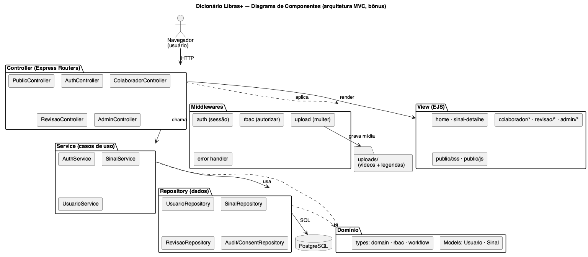

# 🤟 Dicionário Libras+

Expansão do **Dicionário da Língua Brasileira de Sinais (Libras)** — uma aplicação web
acessível e bilíngue (Libras/Português) para **pesquisar, visualizar, submeter, revisar e
administrar** sinais, inspirada no [Dicionário do INES](https://dicionario.ines.gov.br/).

Projeto acadêmico desenvolvido em equipe, com arquitetura **MVC** em **TypeScript/OOP**,
**PostgreSQL**, acessibilidade **WCAG 2.1 AA** e conformidade com a **LGPD**.

---

## ✨ Funcionalidades

- 🔎 **Busca fiel ao INES**: por Palavra, Exemplo, Acepção, Assunto e Nº; ordenação
  (Alfabética / Por assunto / Mão) e filtro alfabético A–Z.
- 🎬 **Detalhe do sinal**: vídeo **com legendas**, configuração de mão, parâmetros gramaticais,
  acepção, exemplo e **variantes regionais** (ex.: PAI — Padrão, RJ, RS).
- 👤 **Papéis e permissões (RBAC)**: Visitante, Colaborador, Revisor e Administrador.
- 📤 **Fluxo de aprovação**: Colaborador submete sinal + vídeo → `PENDENTE` → Revisor
  aprova/rejeita → `PUBLICADO`/`REJEITADO`.
- 🛠️ **Área administrativa**: CRUD completo de **sinais** e de **usuários** + fila de aprovação +
  **trilha de auditoria**.
- ♿ **Acessibilidade WCAG 2.1 AA**: legendas, navegação por teclado, foco visível, contraste ≥ 4.5:1.
- 🔒 **LGPD**: consentimento para mídia com pessoas identificáveis (reforçado para menores) e auditoria.

## 🧱 Stack

| Camada | Tecnologia |
|---|---|
| Linguagem | TypeScript (OOP) |
| Backend | Node.js + Express |
| Views | EJS (renderização no servidor) |
| Banco | PostgreSQL (`pg`, migrations SQL) |
| Auth | sessão (`express-session` + `connect-pg-simple`), senha com **argon2** |
| Upload | `multer` (vídeo + legenda) |
| Testes | Jest + Supertest |
| Qualidade | ESLint + Prettier |
| Infra | Docker Compose (PostgreSQL + pgAdmin) |
| UML | PlantUML |

## 🏛️ Arquitetura (MVC)

`Controller` (rotas) → `Service` (regra de negócio) → `Repository` (dados) → **PostgreSQL**;
`View` (EJS) para apresentação. Detalhes em [docs/03-projeto-arquitetura-mvc.md](docs/03-projeto-arquitetura-mvc.md).



---

## 🚀 Como rodar (passo a passo)

### Pré-requisitos
- **Node.js ≥ 20** e **npm**
- **Docker** + **Docker Compose** (para PostgreSQL + pgAdmin)

### 1) Clonar e instalar
```bash
git clone <URL-do-repositorio>
cd dicionario-libras
npm install
```

### 2) Configurar variáveis de ambiente
```bash
cp .env.example .env
# gere um segredo de sessão forte:
node -e "console.log(require('crypto').randomBytes(48).toString('hex'))"
# cole o valor em SESSION_SECRET dentro do .env
```
> **Porta do banco:** o padrão é **5432**. Se a porta 5432 já estiver ocupada na sua máquina
> (por outra instalação de PostgreSQL), defina `DB_PORT=5433` no `.env` — o `docker-compose`
> publicará o container nessa porta e a aplicação se conectará a ela automaticamente.

### 3) Subir o banco (PostgreSQL + pgAdmin)
> ⚠️ **O Docker Desktop precisa estar aberto/rodando** antes deste passo. Se aparecer
> *"Cannot connect to the Docker daemon"*, abra o Docker Desktop e aguarde ele iniciar.
```bash
docker compose up -d postgres pgadmin
```

### 4) Criar o esquema e popular dados de demonstração
```bash
npm run migrate    # cria as tabelas
npm run seed       # insere usuários e sinais demo (MAMÃE, PAI c/ variantes, etc.)
npx tsx scripts/make-sample-media.ts   # gera as legendas .vtt de demonstração
```

### 5) Iniciar a aplicação
```bash
npm run dev          # desenvolvimento (recarrega ao salvar) — recomendado
# ou:
npm start            # produção (compila com tsc e roda dist/server.js)
# Acesse http://localhost:3000
```

> Atalho: `npm run db:reset` recria o esquema do zero e reaplica o seed.

### 🛠️ Solução de problemas comuns
| Erro no terminal | Causa | Solução |
|---|---|---|
| `Cannot connect to the Docker daemon` / `ECONNREFUSED ...:5433` | Docker parado ou banco fora do ar. | Abra o **Docker Desktop**, aguarde iniciar e rode `docker compose up -d postgres pgadmin`. |
| `Cannot find module .../dist/server.js` | Rodou `npm start` sem compilar. | `npm start` já compila automaticamente (script `prestart`); ou use `npm run dev`. |
| `EADDRINUSE: address already in use :::3000` | Já existe um servidor rodando na porta 3000. | Encerre o processo: `lsof -ti tcp:3000 \| xargs kill` e rode novamente. |
| Página com `AggregateError [ECONNREFUSED]` | App no ar, mas banco fora do ar. | Suba o banco (passo 3) e recarregue. |

### 🐳 Alternativa: tudo via Docker
```bash
docker compose --profile app up --build   # sobe banco + pgadmin + app
# depois, em outro terminal: npm run migrate && npm run seed
```

---

## 👥 Contas de demonstração

| Papel | E-mail | Senha |
|---|---|---|
| Administrador | `admin@libras.gov.br` | `Admin@123` |
| Revisor | `revisor@libras.gov.br` | `Revisor@123` |
| Colaborador | `colaborador@libras.gov.br` | `Colab@123` |

O **Visitante** não precisa de login.

---

## 🐘 Conectar no pgAdmin 4

Existem **duas formas** — a diferença é o `Host`/`Port`. Use a que corresponde ao **seu** pgAdmin.
Em ambas: **Database** `dicionario_libras`, **Username** `libras`, **Password** `libras_dev_password`,
e marque *Save password*.

> ⚠️ Erro comum: `Username` é o usuário do **banco** (`libras`), **não** o login da tela do pgAdmin
> (`admin@admin.com`). E `localhost`/`postgres` e as portas **não** são intercambiáveis (veja abaixo).

### Opção A — pgAdmin instalado na sua máquina (app desktop)
1. *Add New Server* → aba *Connection*:
   - **Host:** `localhost` &nbsp;·&nbsp; **Port:** **`5433`** (a porta publicada no `.env`; use `5432` se você não alterou)
   - Database / Username / Password como acima.

### Opção B — pgAdmin do Docker (web, em http://localhost:5050)
1. Abra **http://localhost:5050** e faça login com `admin@admin.com` / `admin`.
2. *Add New Server* → aba *Connection*:
   - **Host:** `postgres` (nome do serviço na rede do Docker) &nbsp;·&nbsp; **Port:** **`5432`** (porta interna do container)
   - Database / Username / Password como acima.

Depois de conectar, navegue em *Databases → dicionario_libras → Schemas → public → Tables* para
inspecionar `usuario`, `sinal`, `variante_sinal`, `video`, `revisao`, `consent_record`, `audit_log`
(botão direito na tabela → *View/Edit Data → All Rows*).

---

## 🧪 Testes e qualidade

```bash
npm test               # executa a suíte (unit + integração)
npm run test:coverage  # com relatório de cobertura
npm run lint           # ESLint
```
Cobertura atual: **55 testes**, statements ~87% (controllers ~93%, services ~84%).

> Os testes de integração usam um banco separado (`dicionario_libras_test`), criado e migrado
> automaticamente — não afetam os dados de desenvolvimento.

---

## 📁 Estrutura de pastas

```
dicionario-libras/
├─ src/
│  ├─ models/         # Model: entidades com regras (Usuario, Sinal)
│  ├─ types/          # enums canônicos, RBAC, máquina de estados
│  ├─ services/       # casos de uso (auth, sinais, usuários)
│  ├─ repositories/   # acesso a dados (PostgreSQL)
│  ├─ controllers/    # rotas (Express Routers)
│  ├─ views/          # View: templates EJS
│  ├─ middlewares/    # auth, RBAC, upload, erros
│  └─ app.ts / server.ts
├─ migrations/        # esquema SQL
├─ seeds/             # dados de demonstração
├─ tests/             # unit + integração
├─ public/            # CSS e JS estáticos
├─ uploads/           # mídia enviada (gitignored)
├─ docs/              # 6 documentos + diagramas PlantUML
└─ docker-compose.yml
```

---

## 🔀 Fluxo de trabalho Git

- **Uma branch por tarefa**; commits em *Conventional Commits* pt-BR
  (`feat(sinais): ...`, `docs(requisitos): ...`).
- **Pull Request com ≥ 1 revisão** de colega antes do merge (ver
  [Definition of Done](docs/04-desenvolvimento-colaborativo-dod.md)).
- Para publicar no GitHub:
  ```bash
  git remote add origin <URL-do-repositorio-no-GitHub>
  git push -u origin main
  ```

---

## 👨‍💻 Equipe e contribuições

| Integrante | Frente |
|---|---|
| **Gustavo Bada** | Fundação (Docker, domínio/RBAC/workflow), backend MVC/OOP (auth, RBAC, fluxo de aprovação, upload) e interface EJS/WCAG |
| **Vinicius Kruger** | Banco (migrations/seed), testes (unit + integração) e processo/entrega (DoD, README, manual, export) |
| **Gustavo Hold** | Engenharia de requisitos (RF/RNF, histórias, WCAG, LGPD, UC-01) |
| **Lucas K** | Modelagem UML (diagramas PlantUML) e documento de arquitetura MVC |

Detalhamento em [docs/05-descritivo-atividades-equipe.md](docs/05-descritivo-atividades-equipe.md).

## 📚 Documentação completa
1. [Engenharia de Requisitos](docs/01-engenharia-de-requisitos.md)
2. [Modelagem (UML)](docs/02-modelagem/README.md)
3. [Arquitetura MVC](docs/03-projeto-arquitetura-mvc.md)
4. [Desenvolvimento Colaborativo e DoD](docs/04-desenvolvimento-colaborativo-dod.md)
5. [Descritivo de atividades da equipe](docs/05-descritivo-atividades-equipe.md)
6. [Manual do usuário / Handover](docs/06-manual-do-usuario-handover.md)

## 📄 Licença
[MIT](LICENSE).
