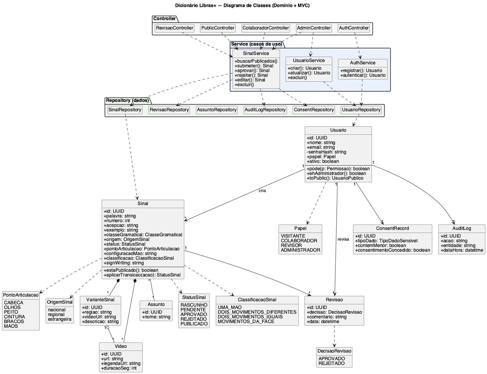
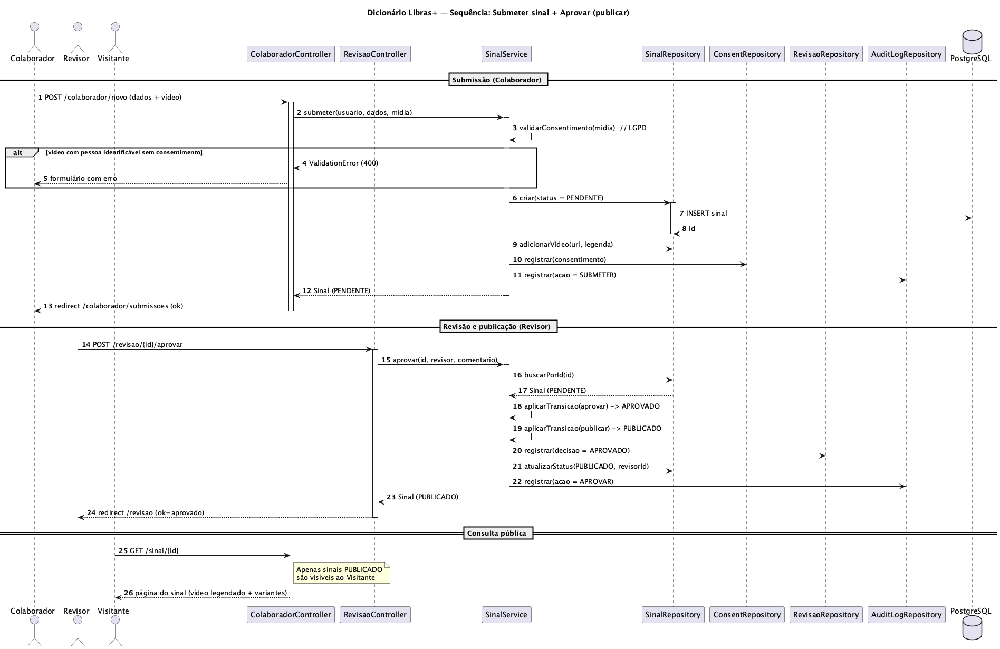
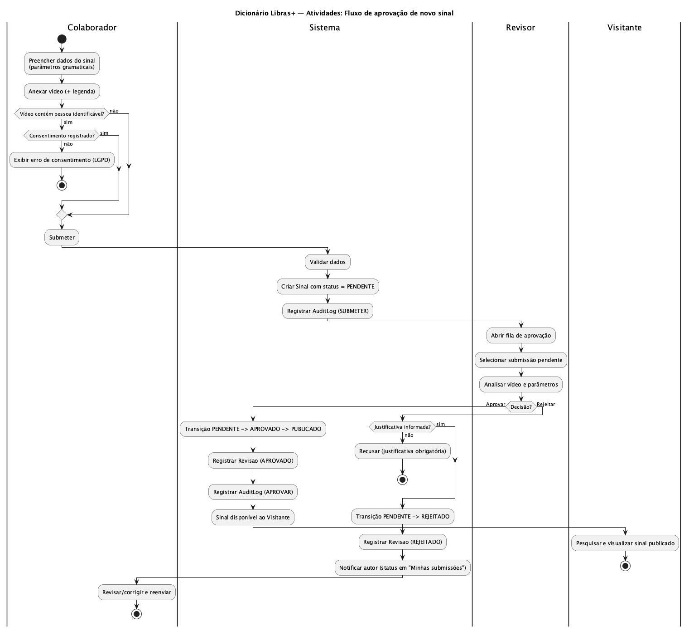
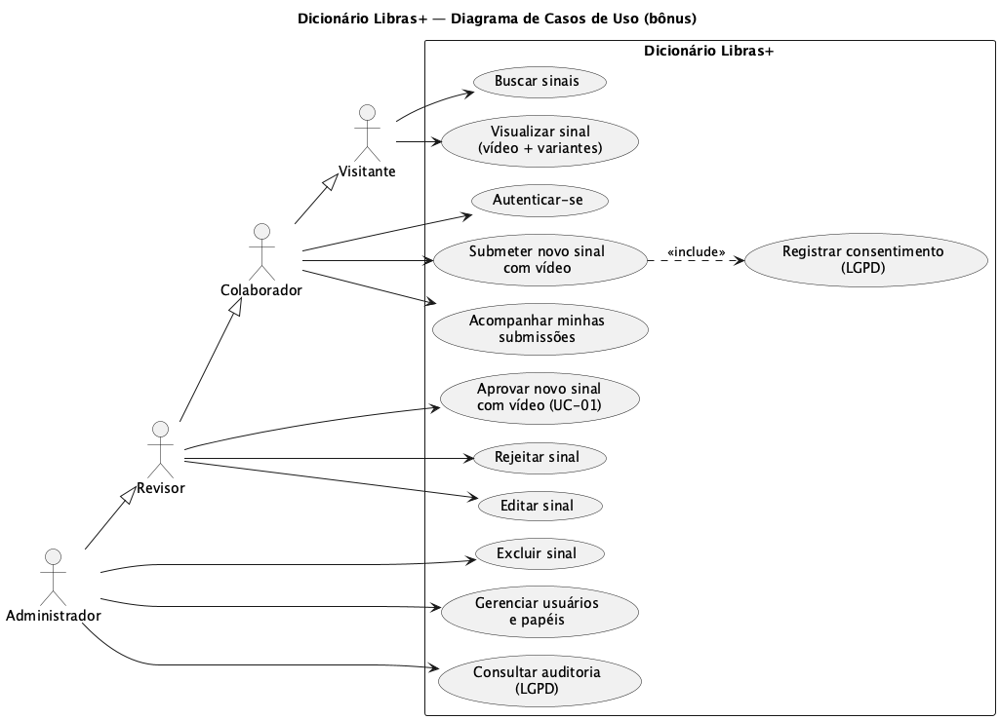

# Modelagem (UML em PlantUML)

Fontes `.puml` versionadas nesta pasta; imagens em `rendered/` (PNG + SVG).
Para regenerar: `npm run diagrams` (requer Java; usa o motor **Smetana**, sem GraphViz).

Todos os diagramas refletem a **fonte canônica** do projeto (`src/types/domain.ts`,
`src/types/rbac.ts`, `src/types/workflow.ts`) e o esquema do banco (`migrations/001_init.sql`).

## Diagrama de Classes (Domínio + MVC)

## Diagrama de Sequência — Submeter + Aprovar (publicar)

## Diagrama de Atividades — Fluxo de aprovação

## (Bônus) Diagrama de Casos de Uso

## (Bônus) Diagrama de Componentes (MVC)

